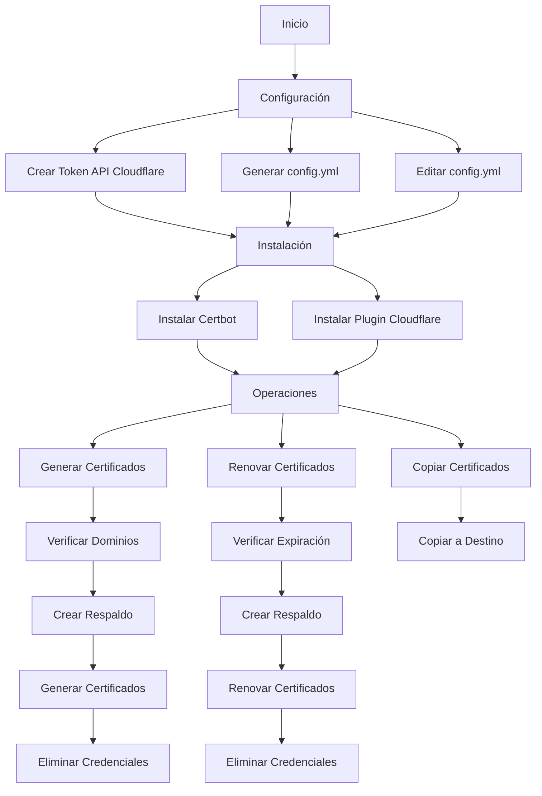

# Generador de Certificados SSL Wildcard con Let's Encrypt y Cloudflare

> **⚠️ AVISO IMPORTANTE**: Esta funcionalidad se encuentra todavía en versión alpha y no es estable para uso en producción. Se recomienda utilizar solo en entornos de prueba hasta que se publique una versión estable.

## Introducción

Los certificados SSL son esenciales para garantizar conexiones seguras en sitios web. Let's Encrypt ofrece certificados gratuitos, pero su renovación puede ser compleja, especialmente cuando se necesita validar múltiples dominios o subdominios.

La validación por desafío DNS es un método que permite verificar la propiedad de un dominio mediante la creación de registros TXT específicos en la configuración DNS. Este método es especialmente útil cuando:
- Necesitas certificados wildcard (*.tudominio.com)
- El servidor web no es accesible públicamente
- Tienes que validar múltiples dominios simultáneamente

### Ventajas de usar la API de Cloudflare

Cloudflare proporciona una API que permite automatizar completamente este proceso:
1. No requiere acceso manual al panel de control
2. Permite la creación y eliminación automática de registros DNS
3. Es ideal para scripts de renovación automática
4. Funciona con certificados wildcard y múltiples dominios

Este script simplifica todo el proceso utilizando la API de Cloudflare para:
- Gestionar automáticamente los registros DNS necesarios
- Generar y renovar certificados
- Mantener copias de seguridad
- Monitorizar fechas de expiración



## Requisitos

- Python 3.6 o superior
- Certbot instalado
- Plugin certbot-dns-cloudflare instalado
- Token de API de Cloudflare con permisos de Zona:DNS:Edit

## Instalación

1. Instalar certbot y el plugin de Cloudflare:
```bash
sudo apt-get install certbot python3-certbot-dns-cloudflare
```

2. Clonar este repositorio:
```bash
git clone https://github.com/tu-usuario/ssl-letsencrypt-cloudflare.git
cd ssl-letsencrypt-cloudflare
```

## Configuración

1. Crear un token de API en Cloudflare:
   - Ve a https://dash.cloudflare.com/profile/api-tokens
   - Crea un nuevo token con permisos de Zona:DNS:Edit
   - Copia el token generado

2. Generar archivo de configuración:
```bash
python3 ssl-wildcard-cloudflare.py --init
```

3. Editar el archivo `config.yml` generado:
```yaml
cloudflare:
  api_token: tu_token_api_cloudflare
email: tu_email@ejemplo.com
domains:
  - example.com
  - otro-dominio.com
dest_path: /ruta/para/certificados
output_dir: /ruta/salida
```

## Uso

El script puede ejecutarse con los siguientes parámetros:

```bash
# Generar archivo de configuración
python3 ssl-wildcard-cloudflare.py --init

# Instalar certbot y plugin
python3 ssl-wildcard-cloudflare.py --install

# Generar certificados
python3 ssl-wildcard-cloudflare.py --generate

# Copiar certificados
python3 ssl-wildcard-cloudflare.py --copy

# Renovar certificados
python3 ssl-wildcard-cloudflare.py --renew

# Mostrar información detallada de la ejecución
python3 ssl-wildcard-cloudflare.py --generate --verbose
```

### Parámetros disponibles

- `--config`: Ruta al archivo de configuración YAML (por defecto: config.yml)
- `--install`: Instala certbot y el plugin de Cloudflare
- `--generate`: Genera los certificados
- `--copy`: Copia los certificados a la ruta de destino
- `--renew`: Renueva los certificados
- `--init`: Genera un archivo config.yml de ejemplo
- `--verbose`: Muestra información detallada de la ejecución

## Características

- Generación de certificados wildcard (*.dominio.com)
- Autenticación DNS automática a través de Cloudflare
- Respaldo automático de certificados existentes
- Renovación automática de certificados próximos a expirar
- Eliminación segura de credenciales temporales
- Modo verbose para depuración

## Seguridad

- El token de API de Cloudflare se almacena de forma segura en el archivo de configuración
- Los archivos temporales con credenciales se eliminan automáticamente después de su uso
- Los certificados se respaldan antes de cualquier operación de modificación

## Notas

- Los certificados se generan en `/etc/letsencrypt/live/`
- Se crean enlaces simbólicos a los certificados más recientes
- Los respaldos se almacenan en `{dest_path}/backups/YYYYMMDD_HHMMSS/`
- Los certificados copiados se guardan en la ruta especificada en `dest_path`

## Solución de problemas

Si encuentras algún error:

1. Verifica que el token de API de Cloudflare tenga los permisos correctos
2. Asegúrate de que los dominios estén correctamente configurados en Cloudflare
3. Ejecuta el script con `--verbose` para ver información detallada
4. Verifica los logs del sistema para más detalles

## Contribuir

Las contribuciones son bienvenidas. Por favor, sigue estos pasos:

1. Haz fork del repositorio
2. Crea una rama para tu feature (`git checkout -b feature/AmazingFeature`)
3. Commit tus cambios (`git commit -m 'Add some AmazingFeature'`)
4. Push a la rama (`git push origin feature/AmazingFeature`)
5. Abre un Pull Request

## Licencia

Este proyecto está licenciado bajo la Licencia MIT - ver el archivo [LICENSE](LICENSE) para más detalles.

